# System Architecture Analysis

## Overview

- **Project**: /home/tom/github/semcod/docval
- **Primary Language**: python
- **Languages**: python: 21, shell: 1
- **Analysis Mode**: static
- **Total Functions**: 120
- **Total Classes**: 22
- **Modules**: 22
- **Entry Points**: 95

## Architecture by Module

### src.docval.cli
- **Functions**: 15
- **File**: `cli.py`

### src.docval.context
- **Functions**: 13
- **File**: `context.py`

### src.docval.validators.crossref
- **Functions**: 12
- **Classes**: 1
- **File**: `crossref.py`

### src.docval.validators.heuristic
- **Functions**: 10
- **Classes**: 1
- **File**: `heuristic.py`

### src.docval.exporters.github
- **Functions**: 10
- **Classes**: 1
- **File**: `github.py`

### src.docval.actions.executor
- **Functions**: 10
- **Classes**: 3
- **File**: `executor.py`

### src.docval.validators.llm_validator
- **Functions**: 9
- **Classes**: 1
- **File**: `llm_validator.py`

### src.docval.exporters.todo
- **Functions**: 8
- **Classes**: 2
- **File**: `todo.py`

### src.docval.exporters.gitlab
- **Functions**: 7
- **Classes**: 1
- **File**: `gitlab.py`

### src.docval.exporters.planfile
- **Functions**: 7
- **Classes**: 1
- **File**: `planfile.py`

### src.docval.reporters.console
- **Functions**: 6
- **Classes**: 1
- **File**: `console.py`

### src.docval.reporters.markdown_report
- **Functions**: 5
- **Classes**: 1
- **File**: `markdown_report.py`

### src.docval.chunker
- **Functions**: 3
- **File**: `chunker.py`

### src.docval.models
- **Functions**: 3
- **Classes**: 8
- **File**: `models.py`

### src.docval.pipeline
- **Functions**: 1
- **File**: `pipeline.py`

### src.docval.reporters.json_report
- **Functions**: 1
- **Classes**: 1
- **File**: `json_report.py`

## Key Entry Points

Main execution flows into the system:

### src.docval.cli.fix
> Validate and apply fixes to documentation.

By default runs in dry-run mode. Use --no-dry-run to apply changes.

Examples:

    docval fix docs/      
- **Calls**: main.command, click.argument, click.option, click.option, click.option, click.option, click.option, click.option

### src.docval.cli.sync_planfile
> Sync docval results to planfile, GitHub, or GitLab.

By default runs in dry-run mode. Use --no-dry-run to apply changes.

Examples:

    docval sync-p
- **Calls**: main.command, click.argument, click.option, click.option, click.option, click.option, click.option, click.option

### src.docval.pipeline.scan
> Run the full validation pipeline.

Args:
    docs_dir: Path to the documentation directory
    project_root: Path to the project root (for code cross-
- **Calls**: docs_dir.resolve, project_root.resolve, src.docval.context.build_context, src.docval.chunker.chunk_directory, sum, HeuristicValidator, heuristic.validate, CrossRefValidator

### src.docval.cli.stats
> Show documentation statistics (no validation).

Examples:

    docval stats docs/
- **Calls**: main.command, click.argument, click.option, src.docval.chunker.chunk_directory, len, sum, sum, sum

### src.docval.cli.scan
> Scan documentation and report issues.

DOCS_DIR is the path to the documentation directory to validate.

Examples:

    docval scan docs/

    docval 
- **Calls**: main.command, click.argument, click.option, click.option, click.option, click.option, click.option, click.option

### src.docval.cli.patch
> Generate a patch file with recommended changes.

Examples:

    docval patch docs/ -o fixes.txt

    docval patch docs/ --llm -o fixes.txt
- **Calls**: main.command, click.argument, click.option, click.option, click.option, click.option, click.option, src.docval.cli._resolve_project_paths

### src.docval.validators.crossref.CrossRefValidator._build_symbol_set
> Build a set of all known code symbols (lowercase for matching).
- **Calls**: set, symbols.add, symbols.add, symbols.add, mod.split, symbols.add, symbols.add, symbols.add

### src.docval.validators.llm_validator.LLMValidator._build_context_summary
> Build a compact project context string for the prompt.
- **Calls**: None.join, parts.append, parts.append, parts.append, parts.append, parts.append, parts.append, parts.append

### src.docval.exporters.github.GitHubExporter.sync_from_planfile
> Sync tickets from planfile.yaml to GitHub.
- **Calls**: planfile_path.read_text, yaml.safe_load, planfile.get, tickets.items, None.get, results.append, results.append, self._get_github

### src.docval.actions.executor.ActionExecutor.generate_patch
> Generate a unified diff patch for all pending actions.
- **Calls**: None.join, lines.append, lines.append, lines.append, lines.append, lines.append, lines.append, lines.append

### src.docval.validators.crossref.CrossRefValidator._check_import_paths
> Check Python import statements in code blocks.
- **Calls**: re.compile, re.compile, code_block_re.finditer, block_match.group, import_re.finditer, any, imp_match.group, imp_match.group

### src.docval.validators.llm_validator.LLMValidator._validate_batch
> Validate multiple chunks in a single LLM call. Returns number validated.
- **Calls**: self._build_batch_prompt, completion_fn, self._parse_batch_response, zip, _STATUS_MAP.get, _ACTION_MAP.get, float, result.get

### src.docval.validators.llm_validator.LLMValidator._validate_chunk
> Validate a single chunk via LLM. Returns True if successful.
- **Calls**: self._build_prompt, completion_fn, self._parse_response, _STATUS_MAP.get, _ACTION_MAP.get, float, parsed.get, parsed.get

### src.docval.exporters.gitlab.GitLabExporter._execute_export
> Actually create GitLab issues.
- **Calls**: ValueError, ImportError, self._generate_title, self._generate_description, None.join, self._generate_labels, requests.post, response.json

### src.docval.exporters.todo.TodoExporter._generate_todo_md
> Generate TODO.md content.
- **Calls**: sum, sum, sum, sum, lines.extend, lines.extend, None.join, lines.extend

### src.docval.reporters.console.ConsoleReporter._print_issues_table
- **Calls**: Table, table.add_column, table.add_column, table.add_column, table.add_column, table.add_column, self.console.print, _STATUS_COLORS.get

### src.docval.validators.heuristic.HeuristicValidator._check_broken_internal_links
> Check for internal Markdown links pointing to non-existent files.
- **Calls**: re.sub, re.sub, re.compile, link_re.finditer, match.group, target.startswith, target.split, candidates.extend

### src.docval.validators.heuristic.HeuristicValidator._check_stale_versions
> Detect references to old version numbers if project version is known.
- **Calls**: re.match, int, re.compile, old_ver_re.findall, current_major.group, chunk.add_issue, None.join, None.join

### src.docval.exporters.gitlab.GitLabExporter._generate_labels
> Generate labels for the issue.
- **Calls**: any, list, labels.append, any, set, labels.append, labels.append, labels.append

### src.docval.exporters.github.GitHubExporter._generate_labels
> Generate labels for the issue.
- **Calls**: any, list, labels.append, any, set, labels.append, labels.append, labels.append

### src.docval.validators.llm_validator.LLMValidator._parse_batch_response
> Parse JSON array from LLM batch response.
- **Calls**: re.sub, re.sub, text.strip, text.strip, json.loads, isinstance, len, len

### src.docval.validators.heuristic.HeuristicValidator._check_duplicates
> Detect near-duplicate content using hash-based O(1) lookup.
- **Calls**: re.sub, hash, None.strip, None.ratio, chunk.add_issue, chunk.content.lower, SequenceMatcher, re.sub

### src.docval.validators.crossref.CrossRefValidator._check_code_references
> Check inline code references like `ClassName` or `function_name`.
- **Calls**: re.findall, ref.lower, ref_lower.split, any, orphaned_refs.append, chunk.add_issue, len, len

### src.docval.exporters.planfile.PlanfileExporter._extract_tickets
> Extract tickets from validation result.
- **Calls**: set, self._map_priority, issue_descriptions.append, labels.add, self._generate_title, None.join, acceptance_criteria.append, list

### src.docval.exporters.github.GitHubExporter._execute_export
> Actually create/update GitHub issues.
- **Calls**: self._get_github, self._generate_title, self._generate_body, self._generate_labels, self._find_existing_issue, created.append, repo.create_issue, created.append

### src.docval.reporters.markdown_report.MarkdownReporter._build_issue_lines
- **Calls**: lines.extend, lines.append, lines.append, lines.append, any, _STATUS_EMOJIS.get, _ACTION_LABELS.get, lines.append

### src.docval.validators.llm_validator.LLMValidator.validate
> Validate chunks via LLM. Returns number of chunks validated.

Args:
    doc_files: Files to validate
    only_uncertain: If True, skip chunks already 
- **Calls**: self._build_context_summary, range, len, ImportError, chunks_to_validate.append, len, self._validate_chunk, self._validate_batch

### src.docval.validators.heuristic.HeuristicValidator.validate
> Run all heuristic checks across all files.
- **Calls**: self._seen_hashes.clear, self._check_empty, self._check_outdated_markers, self._check_broken_internal_links, self._check_todo_fixme, self._check_archive_path, self._check_stale_versions, self._check_duplicates

### src.docval.validators.crossref.CrossRefValidator._check_cli_line
> Check one shell-like line for stale project CLI usage.
- **Calls**: line.strip, line.split, self._potential_cli_invocation, self._matches_known_cli, line.startswith, self._line_contains_known_cli, self._is_common_shell_command, chunk.add_issue

### src.docval.exporters.planfile.PlanfileExporter._build_planfile
> Build planfile dictionary structure.
- **Calls**: self._extract_tickets, self.generated_at.strftime, self.generated_at.strftime, sum, self._calculate_health_score, self.generated_at.isoformat, bool, issues_by_type.get

## Process Flows

Key execution flows identified:

### Flow 1: fix
```
fix [src.docval.cli]
```

### Flow 2: sync_planfile
```
sync_planfile [src.docval.cli]
```

### Flow 3: scan
```
scan [src.docval.pipeline]
  └─ →> build_context
      └─> _collect_src_files
      └─> _extract_python_symbols
          └─> _parse_python_ast
  └─ →> chunk_directory
      └─> discover_md_files
      └─> chunk_file
```

### Flow 4: stats
```
stats [src.docval.cli]
  └─ →> chunk_directory
      └─> discover_md_files
      └─> chunk_file
```

### Flow 5: patch
```
patch [src.docval.cli]
```

### Flow 6: _build_symbol_set
```
_build_symbol_set [src.docval.validators.crossref.CrossRefValidator]
```

### Flow 7: _build_context_summary
```
_build_context_summary [src.docval.validators.llm_validator.LLMValidator]
```

### Flow 8: sync_from_planfile
```
sync_from_planfile [src.docval.exporters.github.GitHubExporter]
```

### Flow 9: generate_patch
```
generate_patch [src.docval.actions.executor.ActionExecutor]
```

### Flow 10: _check_import_paths
```
_check_import_paths [src.docval.validators.crossref.CrossRefValidator]
```

## Key Classes

### src.docval.validators.crossref.CrossRefValidator
> Validate documentation references against actual project code.
- **Methods**: 12
- **Key Methods**: src.docval.validators.crossref.CrossRefValidator.__init__, src.docval.validators.crossref.CrossRefValidator._build_symbol_set, src.docval.validators.crossref.CrossRefValidator.validate, src.docval.validators.crossref.CrossRefValidator._check_code_references, src.docval.validators.crossref.CrossRefValidator._check_import_paths, src.docval.validators.crossref.CrossRefValidator._check_cli_commands, src.docval.validators.crossref.CrossRefValidator._iter_cli_code_lines, src.docval.validators.crossref.CrossRefValidator._check_cli_line, src.docval.validators.crossref.CrossRefValidator._line_contains_known_cli, src.docval.validators.crossref.CrossRefValidator._is_common_shell_command

### src.docval.validators.heuristic.HeuristicValidator
> Apply fast heuristic rules to doc chunks before LLM validation.
- **Methods**: 10
- **Key Methods**: src.docval.validators.heuristic.HeuristicValidator.__init__, src.docval.validators.heuristic.HeuristicValidator.validate, src.docval.validators.heuristic.HeuristicValidator._check_empty, src.docval.validators.heuristic.HeuristicValidator._check_outdated_markers, src.docval.validators.heuristic.HeuristicValidator._check_broken_internal_links, src.docval.validators.heuristic.HeuristicValidator._check_todo_fixme, src.docval.validators.heuristic.HeuristicValidator._check_archive_path, src.docval.validators.heuristic.HeuristicValidator._check_stale_versions, src.docval.validators.heuristic.HeuristicValidator._check_duplicates, src.docval.validators.heuristic.HeuristicValidator._check_minimal_content

### src.docval.exporters.github.GitHubExporter
> Export validation results to GitHub Issues.
- **Methods**: 10
- **Key Methods**: src.docval.exporters.github.GitHubExporter.__init__, src.docval.exporters.github.GitHubExporter._get_github, src.docval.exporters.github.GitHubExporter.export, src.docval.exporters.github.GitHubExporter._preview_export, src.docval.exporters.github.GitHubExporter._execute_export, src.docval.exporters.github.GitHubExporter._find_existing_issue, src.docval.exporters.github.GitHubExporter._generate_title, src.docval.exporters.github.GitHubExporter._generate_body, src.docval.exporters.github.GitHubExporter._generate_labels, src.docval.exporters.github.GitHubExporter.sync_from_planfile

### src.docval.actions.executor.ActionExecutor
> Execute remediation actions on doc files.
- **Methods**: 10
- **Key Methods**: src.docval.actions.executor.ActionExecutor.__init__, src.docval.actions.executor.ActionExecutor.execute, src.docval.actions.executor.ActionExecutor._collect_actions, src.docval.actions.executor.ActionExecutor._should_archive_file, src.docval.actions.executor.ActionExecutor._record_chunk_action, src.docval.actions.executor.ActionExecutor._apply_deletions, src.docval.actions.executor.ActionExecutor._apply_archives, src.docval.actions.executor.ActionExecutor._delete_sections, src.docval.actions.executor.ActionExecutor._archive_file, src.docval.actions.executor.ActionExecutor.generate_patch

### src.docval.validators.llm_validator.LLMValidator
> Validate documentation chunks using an LLM via litellm.
- **Methods**: 9
- **Key Methods**: src.docval.validators.llm_validator.LLMValidator.__init__, src.docval.validators.llm_validator.LLMValidator.validate, src.docval.validators.llm_validator.LLMValidator._validate_batch, src.docval.validators.llm_validator.LLMValidator._validate_chunk, src.docval.validators.llm_validator.LLMValidator._build_batch_prompt, src.docval.validators.llm_validator.LLMValidator._build_prompt, src.docval.validators.llm_validator.LLMValidator._build_context_summary, src.docval.validators.llm_validator.LLMValidator._parse_batch_response, src.docval.validators.llm_validator.LLMValidator._parse_response

### src.docval.exporters.todo.TodoExporter
> Export validation results to TODO.md format.
- **Methods**: 8
- **Key Methods**: src.docval.exporters.todo.TodoExporter.__init__, src.docval.exporters.todo.TodoExporter.export, src.docval.exporters.todo.TodoExporter._extract_tasks, src.docval.exporters.todo.TodoExporter._determine_priority, src.docval.exporters.todo.TodoExporter._generate_title, src.docval.exporters.todo.TodoExporter._generate_labels, src.docval.exporters.todo.TodoExporter._generate_todo_md, src.docval.exporters.todo.TodoExporter._format_task

### src.docval.exporters.gitlab.GitLabExporter
> Export validation results to GitLab Issues.
- **Methods**: 7
- **Key Methods**: src.docval.exporters.gitlab.GitLabExporter.__init__, src.docval.exporters.gitlab.GitLabExporter.export, src.docval.exporters.gitlab.GitLabExporter._preview_export, src.docval.exporters.gitlab.GitLabExporter._execute_export, src.docval.exporters.gitlab.GitLabExporter._generate_title, src.docval.exporters.gitlab.GitLabExporter._generate_description, src.docval.exporters.gitlab.GitLabExporter._generate_labels

### src.docval.exporters.planfile.PlanfileExporter
> Export validation results to planfile.yaml format.
- **Methods**: 7
- **Key Methods**: src.docval.exporters.planfile.PlanfileExporter.__init__, src.docval.exporters.planfile.PlanfileExporter.export, src.docval.exporters.planfile.PlanfileExporter._build_planfile, src.docval.exporters.planfile.PlanfileExporter._extract_tickets, src.docval.exporters.planfile.PlanfileExporter._generate_title, src.docval.exporters.planfile.PlanfileExporter._map_priority, src.docval.exporters.planfile.PlanfileExporter._calculate_health_score

### src.docval.reporters.console.ConsoleReporter
> Print validation results to the console using rich.
- **Methods**: 6
- **Key Methods**: src.docval.reporters.console.ConsoleReporter.__init__, src.docval.reporters.console.ConsoleReporter.report, src.docval.reporters.console.ConsoleReporter._print_summary, src.docval.reporters.console.ConsoleReporter._print_issues_table, src.docval.reporters.console.ConsoleReporter._print_details, src.docval.reporters.console.ConsoleReporter._report_plain

### src.docval.reporters.markdown_report.MarkdownReporter
> Generate a Markdown report of validation results.
- **Methods**: 5
- **Key Methods**: src.docval.reporters.markdown_report.MarkdownReporter.report, src.docval.reporters.markdown_report.MarkdownReporter._build_report_lines, src.docval.reporters.markdown_report.MarkdownReporter._build_summary_lines, src.docval.reporters.markdown_report.MarkdownReporter._build_issue_lines, src.docval.reporters.markdown_report.MarkdownReporter._build_action_lines

### src.docval.models.DocChunk
> A semantic chunk extracted from a Markdown file.
- **Methods**: 4
- **Key Methods**: src.docval.models.DocChunk.char_count, src.docval.models.DocChunk.word_count, src.docval.models.DocChunk.relative_path, src.docval.models.DocChunk.add_issue

### src.docval.models.DocFile
> Represents a single Markdown file with its chunks.
- **Methods**: 2
- **Key Methods**: src.docval.models.DocFile.status_summary, src.docval.models.DocFile.worst_status

### src.docval.models.ValidationResult
> Aggregated result of a validation run.
- **Methods**: 2
- **Key Methods**: src.docval.models.ValidationResult.update_counts, src.docval.models.ValidationResult._count

### src.docval.reporters.json_report.JSONReporter
> Generate a JSON report of validation results.
- **Methods**: 1
- **Key Methods**: src.docval.reporters.json_report.JSONReporter.report

### src.docval.exporters.todo.TodoTask
> A single task for the TODO list.
- **Methods**: 0

### src.docval.models.ChunkStatus
- **Methods**: 0
- **Inherits**: str, enum.Enum

### src.docval.models.ActionType
- **Methods**: 0
- **Inherits**: str, enum.Enum

### src.docval.models.Severity
- **Methods**: 0
- **Inherits**: str, enum.Enum

### src.docval.models.Issue
> A single validation issue found in a doc chunk.
- **Methods**: 0

### src.docval.models.ProjectContext
> Gathered context about the project for cross-referencing.
- **Methods**: 0

## Data Transformation Functions

Key functions that process and transform data:

### src.docval.context._parse_python_ast
> Parse a Python source file and return its AST, or None on failure.
- **Output to**: ast.parse, filepath.read_text

### src.docval.context._parse_toon_files
> Parse .toon.yaml files for code analysis data.
- **Output to**: list, list, root.rglob, root.rglob, tf.read_text

### src.docval.validators.llm_validator.LLMValidator.validate
> Validate chunks via LLM. Returns number of chunks validated.

Args:
    doc_files: Files to validate
- **Output to**: self._build_context_summary, range, len, ImportError, chunks_to_validate.append

### src.docval.validators.llm_validator.LLMValidator._validate_batch
> Validate multiple chunks in a single LLM call. Returns number validated.
- **Output to**: self._build_batch_prompt, completion_fn, self._parse_batch_response, zip, _STATUS_MAP.get

### src.docval.validators.llm_validator.LLMValidator._validate_chunk
> Validate a single chunk via LLM. Returns True if successful.
- **Output to**: self._build_prompt, completion_fn, self._parse_response, _STATUS_MAP.get, _ACTION_MAP.get

### src.docval.validators.llm_validator.LLMValidator._parse_batch_response
> Parse JSON array from LLM batch response.
- **Output to**: re.sub, re.sub, text.strip, text.strip, json.loads

### src.docval.validators.llm_validator.LLMValidator._parse_response
> Parse JSON from LLM response, handling markdown fences.
- **Output to**: re.sub, re.sub, re.search, text.strip, text.strip

### src.docval.validators.heuristic.HeuristicValidator.validate
> Run all heuristic checks across all files.
- **Output to**: self._seen_hashes.clear, self._check_empty, self._check_outdated_markers, self._check_broken_internal_links, self._check_todo_fixme

### src.docval.validators.crossref.CrossRefValidator.validate
> Check each chunk for references to code symbols.
- **Output to**: self._check_code_references, self._check_import_paths, self._check_cli_commands

### src.docval.exporters.todo.TodoExporter._format_task
> Format a single task in Markdown.
- **Output to**: lines.append, lines.append, lines.append, None.join

## Behavioral Patterns

### recursion__decorator_name
- **Type**: recursion
- **Confidence**: 0.90
- **Functions**: src.docval.context._decorator_name

## Public API Surface

Functions exposed as public API (no underscore prefix):

- `src.docval.cli.fix` - 36 calls
- `src.docval.chunker.chunk_file` - 31 calls
- `src.docval.cli.sync_planfile` - 27 calls
- `src.docval.pipeline.scan` - 26 calls
- `src.docval.cli.stats` - 25 calls
- `src.docval.cli.scan` - 21 calls
- `src.docval.cli.patch` - 19 calls
- `src.docval.exporters.github.GitHubExporter.sync_from_planfile` - 17 calls
- `src.docval.actions.executor.ActionExecutor.generate_patch` - 17 calls
- `src.docval.validators.llm_validator.LLMValidator.validate` - 9 calls
- `src.docval.validators.heuristic.HeuristicValidator.validate` - 9 calls
- `src.docval.models.ValidationResult.update_counts` - 9 calls
- `src.docval.context.build_context` - 8 calls
- `src.docval.chunker.discover_md_files` - 7 calls
- `src.docval.reporters.json_report.JSONReporter.report` - 7 calls
- `src.docval.reporters.console.ConsoleReporter.report` - 5 calls
- `src.docval.reporters.markdown_report.MarkdownReporter.report` - 4 calls
- `src.docval.actions.executor.ActionExecutor.execute` - 4 calls
- `src.docval.validators.crossref.CrossRefValidator.validate` - 3 calls
- `src.docval.exporters.planfile.PlanfileExporter.export` - 3 calls
- `src.docval.exporters.todo.TodoExporter.export` - 3 calls
- `src.docval.chunker.chunk_directory` - 2 calls
- `src.docval.cli.main` - 2 calls
- `src.docval.exporters.gitlab.GitLabExporter.export` - 2 calls
- `src.docval.exporters.github.GitHubExporter.export` - 2 calls
- `src.docval.models.DocChunk.add_issue` - 2 calls

## System Interactions

How components interact:

```mermaid
graph TD
    fix --> command
    fix --> argument
    fix --> option
    sync_planfile --> command
    sync_planfile --> argument
    sync_planfile --> option
    scan --> resolve
    scan --> build_context
    scan --> chunk_directory
    scan --> sum
    stats --> command
    stats --> argument
    stats --> option
    stats --> chunk_directory
    stats --> len
    scan --> command
    scan --> argument
    scan --> option
    patch --> command
    patch --> argument
    patch --> option
    _build_symbol_set --> set
    _build_symbol_set --> add
    _build_symbol_set --> split
    _build_context_summa --> join
    _build_context_summa --> append
    sync_from_planfile --> read_text
    sync_from_planfile --> safe_load
    sync_from_planfile --> get
    sync_from_planfile --> items
```



## Reverse Engineering Guidelines

1. **Entry Points**: Start analysis from the entry points listed above
2. **Core Logic**: Focus on classes with many methods
3. **Data Flow**: Follow data transformation functions
4. **Process Flows**: Use the flow diagrams for execution paths
5. **API Surface**: Public API functions reveal the interface

## Context for LLM

Maintain the identified architectural patterns and public API surface when suggesting changes.