# System Architecture Analysis

## Overview

- **Project**: /home/tom/github/semcod/docval
- **Primary Language**: python
- **Languages**: python: 16, shell: 1
- **Analysis Mode**: static
- **Total Functions**: 56
- **Total Classes**: 16
- **Modules**: 17
- **Entry Points**: 44

## Architecture by Module

### src.docval.validators.heuristic
- **Functions**: 10
- **Classes**: 1
- **File**: `heuristic.py`

### src.docval.context
- **Functions**: 9
- **File**: `context.py`

### src.docval.validators.llm_validator
- **Functions**: 6
- **Classes**: 1
- **File**: `llm_validator.py`

### src.docval.validators.crossref
- **Functions**: 6
- **Classes**: 1
- **File**: `crossref.py`

### src.docval.reporters.console
- **Functions**: 6
- **Classes**: 1
- **File**: `console.py`

### src.docval.cli
- **Functions**: 5
- **File**: `cli.py`

### src.docval.actions.executor
- **Functions**: 5
- **Classes**: 2
- **File**: `executor.py`

### src.docval.chunker
- **Functions**: 3
- **File**: `chunker.py`

### src.docval.models
- **Functions**: 3
- **Classes**: 8
- **File**: `models.py`

### src.docval.pipeline
- **Functions**: 1
- **File**: `pipeline.py`

### src.docval.reporters.json_report
- **Functions**: 1
- **Classes**: 1
- **File**: `json_report.py`

### src.docval.reporters.markdown_report
- **Functions**: 1
- **Classes**: 1
- **File**: `markdown_report.py`

## Key Entry Points

Main execution flows into the system:

### src.docval.cli.fix
> Validate and apply fixes to documentation.

By default runs in dry-run mode. Use --no-dry-run to apply changes.

Examples:

    docval fix docs/      
- **Calls**: main.command, click.argument, click.option, click.option, click.option, click.option, click.option, click.option

### src.docval.reporters.markdown_report.MarkdownReporter.report
> Write validation report to a Markdown file.
- **Calls**: result.update_counts, lines.append, lines.append, lines.append, lines.append, lines.append, lines.append, lines.append

### src.docval.pipeline.scan
> Run the full validation pipeline.

Args:
    docs_dir: Path to the documentation directory
    project_root: Path to the project root (for code cross-
- **Calls**: docs_dir.resolve, project_root.resolve, src.docval.context.build_context, src.docval.chunker.chunk_directory, sum, HeuristicValidator, heuristic.validate, CrossRefValidator

### src.docval.cli.stats
> Show documentation statistics (no validation).

Examples:

    docval stats docs/
- **Calls**: main.command, click.argument, click.option, src.docval.chunker.chunk_directory, len, sum, sum, sum

### src.docval.cli.scan
> Scan documentation and report issues.

DOCS_DIR is the path to the documentation directory to validate.

Examples:

    docval scan docs/

    docval 
- **Calls**: main.command, click.argument, click.option, click.option, click.option, click.option, click.option, click.option

### src.docval.cli.patch
> Generate a patch file with recommended changes.

Examples:

    docval patch docs/ -o fixes.txt

    docval patch docs/ --llm -o fixes.txt
- **Calls**: main.command, click.argument, click.option, click.option, click.option, click.option, click.option, run_scan

### src.docval.validators.crossref.CrossRefValidator._build_symbol_set
> Build a set of all known code symbols (lowercase for matching).
- **Calls**: set, symbols.add, symbols.add, symbols.add, mod.split, symbols.add, symbols.add, symbols.add

### src.docval.validators.llm_validator.LLMValidator._build_context_summary
> Build a compact project context string for the prompt.
- **Calls**: None.join, parts.append, parts.append, parts.append, parts.append, parts.append, parts.append, parts.append

### src.docval.actions.executor.ActionExecutor.generate_patch
> Generate a unified diff patch for all pending actions.
- **Calls**: None.join, lines.append, lines.append, lines.append, lines.append, lines.append, lines.append, lines.append

### src.docval.validators.crossref.CrossRefValidator._check_import_paths
> Check Python import statements in code blocks.
- **Calls**: re.compile, re.compile, code_block_re.finditer, block_match.group, import_re.finditer, any, imp_match.group, imp_match.group

### src.docval.validators.llm_validator.LLMValidator._validate_chunk
> Validate a single chunk via LLM. Returns True if successful.
- **Calls**: self._build_prompt, completion_fn, self._parse_response, _STATUS_MAP.get, _ACTION_MAP.get, float, parsed.get, parsed.get

### src.docval.reporters.console.ConsoleReporter._print_issues_table
- **Calls**: Table, table.add_column, table.add_column, table.add_column, table.add_column, table.add_column, self.console.print, _STATUS_COLORS.get

### src.docval.validators.heuristic.HeuristicValidator._check_stale_versions
> Detect references to old version numbers if project version is known.
- **Calls**: re.match, int, re.compile, old_ver_re.findall, current_major.group, chunk.add_issue, None.join, None.join

### src.docval.validators.crossref.CrossRefValidator._check_code_references
> Check inline code references like `ClassName` or `function_name`.
- **Calls**: re.findall, ref.lower, ref_lower.split, any, orphaned_refs.append, chunk.add_issue, len, len

### src.docval.actions.executor.ActionExecutor.execute
> Apply all pending actions. Returns summary.
- **Calls**: ActionResult, files_with_deletions.items, all, files_to_archive.append, self._delete_sections, self._archive_file, None.append, result.errors.append

### src.docval.validators.heuristic.HeuristicValidator.validate
> Run all heuristic checks across all files.
- **Calls**: self._seen_chunks.clear, self._check_empty, self._check_outdated_markers, self._check_broken_internal_links, self._check_todo_fixme, self._check_archive_path, self._check_stale_versions, self._check_duplicates

### src.docval.validators.heuristic.HeuristicValidator._check_duplicates
> Detect near-duplicate content across chunks using SequenceMatcher.
- **Calls**: re.sub, self._seen_chunks.append, None.strip, None.quick_ratio, None.ratio, chunk.content.lower, SequenceMatcher, chunk.add_issue

### src.docval.models.ValidationResult.update_counts
- **Calls**: len, sum, self._count, self._count, self._count, self._count, self._count, self._count

### src.docval.validators.llm_validator.LLMValidator._parse_response
> Parse JSON from LLM response, handling markdown fences.
- **Calls**: re.sub, re.sub, re.search, text.strip, text.strip, json.loads, json.loads, match.group

### src.docval.reporters.console.ConsoleReporter._report_plain
> Fallback plain text report when rich is not available.
- **Calls**: print, print, print, print, print, print, print, print

### src.docval.actions.executor.ActionExecutor._delete_sections
> Remove line ranges from a file.
- **Calls**: None.splitlines, sorted, filepath.write_text, max, min, None.join, filepath.read_text, len

### src.docval.validators.crossref.CrossRefValidator._check_cli_commands
> Check CLI command references in code blocks.
- **Calls**: re.compile, cli_re.finditer, block_match.group, block.splitlines, line.strip, line.split, line.startswith

### src.docval.validators.heuristic.HeuristicValidator._check_broken_internal_links
> Check for internal Markdown links pointing to non-existent files.
- **Calls**: re.compile, link_re.finditer, match.group, target.startswith, target.split, resolved.exists, chunk.add_issue

### src.docval.validators.heuristic.HeuristicValidator._check_minimal_content
> Flag heading-only sections with no meaningful body.
- **Calls**: None.splitlines, chunk.add_issue, chunk.content.strip, len, len, l.strip, re.match

### src.docval.reporters.json_report.JSONReporter.report
> Write validation report as JSON.
- **Calls**: result.update_counts, output.write_text, None.append, json.dumps, None.append, round, round

### src.docval.validators.heuristic.HeuristicValidator._check_empty
> Flag chunks with no meaningful content.
- **Calls**: None.strip, None.strip, len, chunk.add_issue, re.sub, re.sub

### src.docval.validators.heuristic.HeuristicValidator._check_archive_path
> Files in archive/ directories are likely outdated.
- **Calls**: str, None.startswith, rel.lower, chunk.add_issue, rel.lower

### src.docval.reporters.console.ConsoleReporter.report
> Print full validation report.
- **Calls**: result.update_counts, self._print_summary, self._print_issues_table, self._report_plain, self._print_details

### src.docval.actions.executor.ActionExecutor._archive_file
> Move a file to the archive directory, preserving relative path.
- **Calls**: filepath.relative_to, dest.parent.mkdir, shutil.move, str, str

### src.docval.validators.llm_validator.LLMValidator.validate
> Validate chunks via LLM. Returns number of chunks validated.

Args:
    doc_files: Files to validate
    only_uncertain: If True, skip chunks already 
- **Calls**: self._build_context_summary, ImportError, self._validate_chunk, time.sleep

## Process Flows

Key execution flows identified:

### Flow 1: fix
```
fix [src.docval.cli]
```

### Flow 2: report
```
report [src.docval.reporters.markdown_report.MarkdownReporter]
```

### Flow 3: scan
```
scan [src.docval.pipeline]
  └─ →> build_context
      └─> _collect_src_files
      └─> _extract_python_symbols
  └─ →> chunk_directory
      └─> discover_md_files
      └─> chunk_file
```

### Flow 4: stats
```
stats [src.docval.cli]
  └─ →> chunk_directory
      └─> discover_md_files
      └─> chunk_file
```

### Flow 5: patch
```
patch [src.docval.cli]
```

### Flow 6: _build_symbol_set
```
_build_symbol_set [src.docval.validators.crossref.CrossRefValidator]
```

### Flow 7: _build_context_summary
```
_build_context_summary [src.docval.validators.llm_validator.LLMValidator]
```

### Flow 8: generate_patch
```
generate_patch [src.docval.actions.executor.ActionExecutor]
```

### Flow 9: _check_import_paths
```
_check_import_paths [src.docval.validators.crossref.CrossRefValidator]
```

### Flow 10: _validate_chunk
```
_validate_chunk [src.docval.validators.llm_validator.LLMValidator]
```

## Key Classes

### src.docval.validators.heuristic.HeuristicValidator
> Apply fast heuristic rules to doc chunks before LLM validation.
- **Methods**: 10
- **Key Methods**: src.docval.validators.heuristic.HeuristicValidator.__init__, src.docval.validators.heuristic.HeuristicValidator.validate, src.docval.validators.heuristic.HeuristicValidator._check_empty, src.docval.validators.heuristic.HeuristicValidator._check_outdated_markers, src.docval.validators.heuristic.HeuristicValidator._check_broken_internal_links, src.docval.validators.heuristic.HeuristicValidator._check_todo_fixme, src.docval.validators.heuristic.HeuristicValidator._check_archive_path, src.docval.validators.heuristic.HeuristicValidator._check_stale_versions, src.docval.validators.heuristic.HeuristicValidator._check_duplicates, src.docval.validators.heuristic.HeuristicValidator._check_minimal_content

### src.docval.validators.llm_validator.LLMValidator
> Validate documentation chunks using an LLM via litellm.
- **Methods**: 6
- **Key Methods**: src.docval.validators.llm_validator.LLMValidator.__init__, src.docval.validators.llm_validator.LLMValidator.validate, src.docval.validators.llm_validator.LLMValidator._validate_chunk, src.docval.validators.llm_validator.LLMValidator._build_prompt, src.docval.validators.llm_validator.LLMValidator._build_context_summary, src.docval.validators.llm_validator.LLMValidator._parse_response

### src.docval.validators.crossref.CrossRefValidator
> Validate documentation references against actual project code.
- **Methods**: 6
- **Key Methods**: src.docval.validators.crossref.CrossRefValidator.__init__, src.docval.validators.crossref.CrossRefValidator._build_symbol_set, src.docval.validators.crossref.CrossRefValidator.validate, src.docval.validators.crossref.CrossRefValidator._check_code_references, src.docval.validators.crossref.CrossRefValidator._check_import_paths, src.docval.validators.crossref.CrossRefValidator._check_cli_commands

### src.docval.reporters.console.ConsoleReporter
> Print validation results to the console using rich.
- **Methods**: 6
- **Key Methods**: src.docval.reporters.console.ConsoleReporter.__init__, src.docval.reporters.console.ConsoleReporter.report, src.docval.reporters.console.ConsoleReporter._print_summary, src.docval.reporters.console.ConsoleReporter._print_issues_table, src.docval.reporters.console.ConsoleReporter._print_details, src.docval.reporters.console.ConsoleReporter._report_plain

### src.docval.actions.executor.ActionExecutor
> Execute remediation actions on doc files.
- **Methods**: 5
- **Key Methods**: src.docval.actions.executor.ActionExecutor.__init__, src.docval.actions.executor.ActionExecutor.execute, src.docval.actions.executor.ActionExecutor._delete_sections, src.docval.actions.executor.ActionExecutor._archive_file, src.docval.actions.executor.ActionExecutor.generate_patch

### src.docval.models.DocChunk
> A semantic chunk extracted from a Markdown file.
- **Methods**: 4
- **Key Methods**: src.docval.models.DocChunk.char_count, src.docval.models.DocChunk.word_count, src.docval.models.DocChunk.relative_path, src.docval.models.DocChunk.add_issue

### src.docval.models.DocFile
> Represents a single Markdown file with its chunks.
- **Methods**: 2
- **Key Methods**: src.docval.models.DocFile.status_summary, src.docval.models.DocFile.worst_status

### src.docval.models.ValidationResult
> Aggregated result of a validation run.
- **Methods**: 2
- **Key Methods**: src.docval.models.ValidationResult.update_counts, src.docval.models.ValidationResult._count

### src.docval.reporters.json_report.JSONReporter
> Generate a JSON report of validation results.
- **Methods**: 1
- **Key Methods**: src.docval.reporters.json_report.JSONReporter.report

### src.docval.reporters.markdown_report.MarkdownReporter
> Generate a Markdown report of validation results.
- **Methods**: 1
- **Key Methods**: src.docval.reporters.markdown_report.MarkdownReporter.report

### src.docval.actions.executor.ActionResult
> Summary of executed actions.
- **Methods**: 0

### src.docval.models.ChunkStatus
- **Methods**: 0
- **Inherits**: str, enum.Enum

### src.docval.models.ActionType
- **Methods**: 0
- **Inherits**: str, enum.Enum

### src.docval.models.Severity
- **Methods**: 0
- **Inherits**: str, enum.Enum

### src.docval.models.Issue
> A single validation issue found in a doc chunk.
- **Methods**: 0

### src.docval.models.ProjectContext
> Gathered context about the project for cross-referencing.
- **Methods**: 0

## Data Transformation Functions

Key functions that process and transform data:

### src.docval.context._parse_toon_files
> Parse .toon.yaml files for code analysis data.
- **Output to**: list, list, root.rglob, root.rglob, tf.read_text

### src.docval.validators.llm_validator.LLMValidator.validate
> Validate chunks via LLM. Returns number of chunks validated.

Args:
    doc_files: Files to validate
- **Output to**: self._build_context_summary, ImportError, self._validate_chunk, time.sleep

### src.docval.validators.llm_validator.LLMValidator._validate_chunk
> Validate a single chunk via LLM. Returns True if successful.
- **Output to**: self._build_prompt, completion_fn, self._parse_response, _STATUS_MAP.get, _ACTION_MAP.get

### src.docval.validators.llm_validator.LLMValidator._parse_response
> Parse JSON from LLM response, handling markdown fences.
- **Output to**: re.sub, re.sub, re.search, text.strip, text.strip

### src.docval.validators.crossref.CrossRefValidator.validate
> Check each chunk for references to code symbols.
- **Output to**: self._check_code_references, self._check_import_paths, self._check_cli_commands

### src.docval.validators.heuristic.HeuristicValidator.validate
> Run all heuristic checks across all files.
- **Output to**: self._seen_chunks.clear, self._check_empty, self._check_outdated_markers, self._check_broken_internal_links, self._check_todo_fixme

## Behavioral Patterns

### recursion__decorator_name
- **Type**: recursion
- **Confidence**: 0.90
- **Functions**: src.docval.context._decorator_name

## Public API Surface

Functions exposed as public API (no underscore prefix):

- `src.docval.cli.fix` - 39 calls
- `src.docval.chunker.chunk_file` - 31 calls
- `src.docval.reporters.markdown_report.MarkdownReporter.report` - 29 calls
- `src.docval.pipeline.scan` - 26 calls
- `src.docval.cli.stats` - 25 calls
- `src.docval.cli.scan` - 21 calls
- `src.docval.cli.patch` - 19 calls
- `src.docval.actions.executor.ActionExecutor.generate_patch` - 17 calls
- `src.docval.actions.executor.ActionExecutor.execute` - 10 calls
- `src.docval.validators.heuristic.HeuristicValidator.validate` - 9 calls
- `src.docval.models.ValidationResult.update_counts` - 9 calls
- `src.docval.context.build_context` - 8 calls
- `src.docval.chunker.discover_md_files` - 7 calls
- `src.docval.reporters.json_report.JSONReporter.report` - 7 calls
- `src.docval.reporters.console.ConsoleReporter.report` - 5 calls
- `src.docval.validators.llm_validator.LLMValidator.validate` - 4 calls
- `src.docval.validators.crossref.CrossRefValidator.validate` - 3 calls
- `src.docval.chunker.chunk_directory` - 2 calls
- `src.docval.cli.main` - 2 calls
- `src.docval.models.DocChunk.add_issue` - 2 calls

## System Interactions

How components interact:

```mermaid
graph TD
    fix --> command
    fix --> argument
    fix --> option
    report --> update_counts
    report --> append
    scan --> resolve
    scan --> build_context
    scan --> chunk_directory
    scan --> sum
    stats --> command
    stats --> argument
    stats --> option
    stats --> chunk_directory
    stats --> len
    scan --> command
    scan --> argument
    scan --> option
    patch --> command
    patch --> argument
    patch --> option
    _build_symbol_set --> set
    _build_symbol_set --> add
    _build_symbol_set --> split
    _build_context_summa --> join
    _build_context_summa --> append
    generate_patch --> join
    generate_patch --> append
    _check_import_paths --> compile
    _check_import_paths --> finditer
    _check_import_paths --> group
```



## Reverse Engineering Guidelines

1. **Entry Points**: Start analysis from the entry points listed above
2. **Core Logic**: Focus on classes with many methods
3. **Data Flow**: Follow data transformation functions
4. **Process Flows**: Use the flow diagrams for execution paths
5. **API Surface**: Public API functions reveal the interface

## Context for LLM

Maintain the identified architectural patterns and public API surface when suggesting changes.